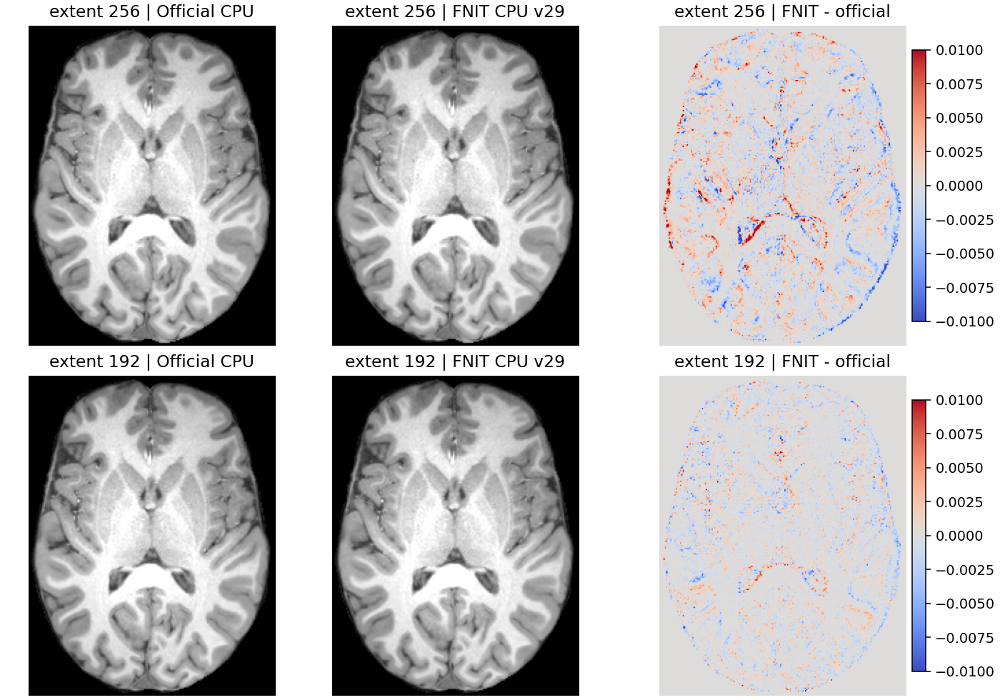
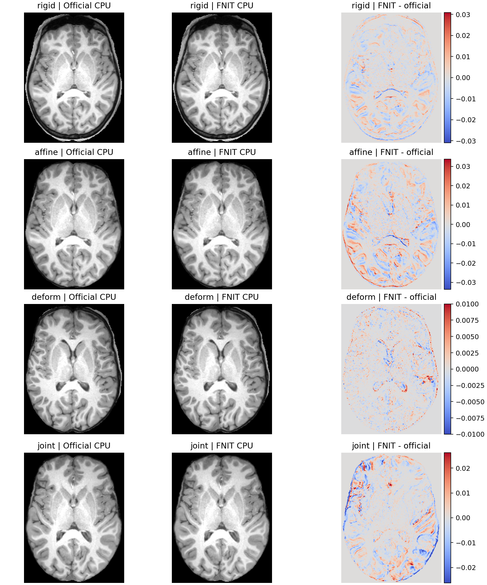

# SynthMorph CPU 精度续修：2026-10-04

本轮从已发布 `f1cbdab10fbfd573c3aa1b3461aa086dab220cfb` 继续修复 CPU。真实输入、资源许可及服务器统一索引均重新核对；冻结源码、环境 prefix 和先前结果保持原实体路径。影像 I/O 使用 nibabel，计算使用 PyTorch；最新 CPU joint 的 4×4 矩阵平方根使用 FNIT 自有的 Eigen 小适配器。原版 FreeSurfer、Surfa、TensorFlow 仅在独立参考进程中运行。

## 最新 CPU joint 修复：192 和 256 固定门均通过

### 2026-10-05：最终 v35 完整采样接入验收

最终 NumBa helper SHA `f87ae99bf1a4fb8fc42eb196801871dbaa7f141f135bcb4a761a7c979ebfdfcd`，preprocessing SHA `1c9f370c5904804b66e4ad7a51c4b558b19982c583846f210689f2766010139b`；采用下节 v34 的安全 Eigen loader。baseline / candidate 冻结清单 SHA 为 `358b80ca61f5f5842ff72d0281c2bc86280fd996d07506dd206d2ea455a74111` / `27151ecb3e7edd14fe191ebbbee71abcf5f798b5273ef503f416db4ac48940f3`。两个清单的全部 1,231 / 1,232 文件现场重验，实际导入源文件和本次提交源文件逐一匹配。权重和公开 T1 的大小/SHA 在计时前核对。

[full_sampler_v35.public.json](full_sampler_v35.public.json) 包含默认256 A1(v34)→C1(v35)→C2(v35)→A2(v34)、192 和完全物化 API。每次同八物理核、四个线程环境均8、CUDA隐藏；实际 candidate NumBa后端、请求8线程及 mask恢复均核对。**所有完整两图两场数组、header/extensions/affine、shape和dtype都与已验收v29相同**。仅借这些精确相同结果传递既有官方固定门，原软件完整CNN不重复。只读 scorer 首次因冻结包不包含验证脚本依赖而在 import 退出；原日志保留，补供已核对的三个既有评分脚本后继续评分，生产源码和完整拟合没有重跑。

| 默认256，完整CLI秒 | A1(v34) | C1(v35，空NumBa cache) | C2(v35，新进程复用cache) | A2(v34) |
| --- | ---: | ---: | ---: | ---: |
| 运行时间 | 171.484 | 159.966 | 150.207 | 154.704 |

中位数 **163.094→155.086 s**，该组下降 **4.91%**；load44–57，共享节点，页面缓存未清空，不声称稳定吞吐倍数。256 RSS峰11.718–11.799 GB；192 / hyper0.75 / steps5 **87.383 s**、RSS5.449 GB，单次单列。

物化 API 读取1.016 / 模型加载3.619 / API121.043 / 保存21.466 s，带observer、诊断数组保存与启动的worker166.986 s，RSS12.081 GB；输入未改，两图两场与CLI全同。嵌套网络时钟见JSON，不能相加为完整时间。最终有限raw/normalized各47,710,208值位级门，以及暖采样5.35/6.07倍、冷256慢12.3%均在[采样报告](../cpu_raw_sampler_20261004/README.md)单列。成熟PyTorch子函数此次改变仅是安全CPU分支的有序采样入口；CPU训练/梯度/autocast、其他设备保留原Torch。

[GPU隔离审计](gpu_route_v35.public.json) 14项全部通过，包括入口及CPUguard AST、六核心文件与既有完整H100父版本SHA绑定、全局精度策略不变、3个importtrap合同和实际小CUDA的3种采样位级一致。完整H10017.836GB及两图两场证明来自既有run，不重跑CNN或以小合同代替速度benchmark。生产helper与评分身份合同 **41 passed，6.12 s**；只列本次实际执行的合同。

### 2026-10-05：实际 Conda 缓存能力问题已修复

新的 v33 缓存保护在 nodecw7 的 Python 中遇到 `NotImplementedError: chmod: follow_symlinks unavailable on this platform`，验证在构建前退出，原失败记录保留。v34 使用 `O_DIRECTORY | O_NOFOLLOW` 打开目录；在同一文件描述符上检查类型和当前用户所有权、执行 `fchmod` 并确认权限确为 `0700`，退出时关闭描述符。继续拒绝链接、错误所有者及不落实权限的文件系统，没有退回跟随路径修改权限。

最终源码 SHA `ff7936cf2d89c740e09ba164a7c6a76fcebd22e889fd33f8c1a419a25c71a426`，与新冻结的全部 1,231 个文件逐一核对。实际独立 Conda Eigen `3.4.0` / GCC `11.4.0` 构建完成，529 份头文件、compiler、argv/flags 和 binary 指纹见 [eigen_loader_v34.public.json](eigen_loader_v34.public.json)。两种 extent 保存的 fit₀、fit₁、average、inverse 共 **8 个真实矩阵**全部旧/新输出字节相同，重复 cached 调用也相同；目录 `0700`、文件 `0600`。CPU 数值正文和 CUDA 路线没有改变。

首次构建与调用 `19.581485 s`、重复调用 `0.000058 s`，整个新进程验证 `22.288850 s`、sampled process-tree RSS `1.517 GB`；同 nodecw7 八物理核与任务锁，load 51–56。不是完整配准速度比较。最终缓存合同 9 项通过，包括不支持 no-follow chmod 的 Python，以及权限未落实时的明确拒绝。这次独立构建验证没有替代全仓全新 Conda 环境安装验收。

最新 v29 在相同原始 T1、既定参数和原误差门下通过完整配准：extent256 `hyper=0.5, steps=7` 与 extent192 `hyper=0.75, steps=5` 的两向影像、场及严格零边界均通过。完整记录见[最新公共 JSON](joint_precision_v29.public.json)。最终源码另加 inference policy 保护，标准 CLI 的 eval/float32 分支与 v29 数学相同；保存的两种 extent 真实网络输入再次验证 features 和仿射矩阵逐值相同。完整 CNN/CLI、物化 API、GPU pair 的实际 v29 SHA 与最终保护源码 SHA 分别记录。

### 首差与最小修复

1. CPU joint 初始网络输入改用原始体素坐标的有序八角插值；保留原 einsum 坐标和闭区间中心域。两种 extent 的两幅实际原版输入共 `47,710,208` 个 float32 值逐值相同。最终图像 sampler、共享 World、独立 apply、其他模式和 CUDA 采样不变。
2. 仿射特征仅在普通 CPU joint 推理使用临时 `channels_last_3d` 输入/权重和显式 oneDNN 卷积。PyTorch 2.5.1 在 `6³×256`、`8³×256` 小网格默认选 Slow3d；只改布局仍有误差。直接选择既有 `torch.mkldnn_convolution` 后，真实两向 features 在两种 extent 全部逐值匹配原版；参数内容、stride 和进程全局 backend policy 不变。
3. CPU joint 的 mass、moment、独立 denominator、权重、4×4 LU/solve 和中心组合使用明确的 FP32 运算顺序。平方根使用独立 Conda Eigen `3.4.0` 的自有小适配器；编译无 native、fast-math 或 FMA contraction。不是调用原软件，也没有复制原软件配准代码。
4. 新分支只用于 eval、无梯度、float32、正常九层 Conv3d、无 CPU autocast、无 leaf/global hooks 的推理。训练、梯度、禁用 oneDNN、自定义层或观察各卷积的调用保留已发布 v7 CPU 归约及原 Torch 后段；detector 自身 forward/pre hooks 正常执行一次。CUDA 从入口返回原路线，不导入三个 CPU helper。

### 完整真实验收

| v29 完整新进程 CLI | 时长（秒） | sampled RSS（GB） | forward / inverse 场 RMSE（mm） | forward 严格零边界 | inverse 上边界 NRMSE |
|---|---:|---:|---:|---|---:|
| extent256 | 184.288 | 11.763 | `1.31021e−5 / 1.68163e−5` | 27,653 点误差全为零 | `3.42879e−6` |
| extent192 | 100.162 | 6.312 | `9.85699e−6 / 1.05717e−5` | 32,866 点误差全为零 | `1.59068e−6` |

两向场最大误差≤`0.001 mm`、RMSE≤`0.0001 mm`，影像全 FOV/独立脑 mask/坐标上边界 NRMSE≤`0.001`；参考区域零动态范围要求严格零误差。没有修改阈值、补零或改变 fill。保存的原版 observer 最终两图两场与正式原版 CLI 的解压后完整 NIfTI 字节相同，有限层诊断的最终 features 也与这条真实路线相同。

当前相邻计时按 **A1(v7) → C1(v29) → 原版 → C2(v29) → A2(v7)**，同 nodecw7 八物理核、同锁、新进程、完整双向输出。v7 为 `182.312 / 170.276 s`，v29 为 `194.054 / 176.282 s`；两对分别慢约 `6.4% / 3.5%`，中位数 `185.168 / 176.294 s`，约慢 `5.0%`。当前原版完整 CLI `691.550 s`；节点有大量内存任务及共享存储等待，不能用该单次值声称稳定倍数。GNU time 的 user/sys、CPU占比、缺页、上下文切换和 I/O 与时序、负载、源码分别保存在 JSON。

完全物化 joint API 与 CLI 两图、两场、完整 header/extensions/affine 全同，输入未修改：输入读取/物化 `1.003 s`，模型加载 `4.039 s`，API `146.031 s`，保存 `23.837 s`；含 observer、npy 保存及进程启动的 worker `194.019 s`。嵌套 affine 的两个 detector 为 `2.651 / 2.433 s`，affine inclusive 为 `5.353 s`；两个 deform 为 `56.609 / 60.436 s`，顶层网络 `129.981 s`。这些边界有嵌套，不能相加为 CLI。有限真实输入的 A-B-B-A 采样控制中，extent256 两图旧 grid_sample 每次 `1.18–2.03 s`，有序八角 `2.92–3.95 s`，两图平均额外约 `4.08 s`；extent192 分别 `0.50–0.60 / 1.06–1.42 s`，两图平均额外 `1.38 s`。新八角的全部 normalized 值仍逐值匹配实际原版。barycenter/weights/LU 各为毫秒级，cached binary 首次进程加载约 `0.10 s`，同进程后续 sqrt 约 `0.00014 s`。有限成本与全 CLI 分开记录，不把全部网络/I/O 负载差归为新增插值成本。

当前 rigid/affine/deform CLI 分别 `22.791 / 21.536 / 162.754 s`，两向完整输出按已通过原版固定门的版本逐值检查；rigid/affine 返回 LTA 再由最终源码应用到两个真实输入，核对图像/完整头与几何。原 CPU World 的既有真实 DWI 回归保持，共享采样源码未改。

H100 **GPU1 UUID `e25cac06-0ce8-a833-abf9-09ab18c9c9ba`** 上同公共锁的 v7/v29 完整 joint pair，两图两场 npy SHA 和完整图像 header/extensions/shape/affine 全同，两个入口均确认 CPU helper 未加载。reserved 均 `17,836,277,760 bytes`，quota `19,000,000,000 bytes`。旧/新已加载 API `6.90588 / 6.83554 s`，完整 worker `45.1056 / 40.1046 s`；存在外部 GPU 工作，只列同场观测。当前 GPU1 时间不与历史 GPU0 affine 混比。

### 依赖与构建

主页 Conda 环境固定 `eigen=3.4.0`、GCC/GXX `11`。新 CPU joint 首次使用时懒构建 `_cpu_eigen_sqrt.cpp`；Python wheel/sdist 均包含这份自有源码和三个 helper，不包含 SynthMorph 权重或影像。普通 rigid/affine/deform 及 CUDA 不需要加载适配器。默认缓存为 `~/.cache/fnit/synthmorph/cpu_eigen`；可用 `FNIT_SYNTHMORPH_BUILD_CACHE` 指定独立缓存，`CXX`、`FNIT_EIGEN_INCLUDE` 指定独立 Conda compiler/headers。缺少依赖时报明确错误；不能改用原软件 headers/runtime。缓存 identity 绑定源码、全部 Eigen 头、compiler 内容/版本及 argv/flags，二进制另校验 SHA。共享文件系统 ENOLCK 只作有界重试。

首次包含构建的算术阶段 `18.191 s`，含进程启动的 stage worker `20.526 s`；另一已有缓存阶段进程 `2.255 s`。上面完整 CLI 已有编译缓存，首次使用成本不能隐藏在 warmed 时间内。Eigen 3.4.0 与原 TensorFlow 所用版本仍有极少量仿射尾数差，完整影像/场原门才是最终验收。



显示前使用独立原版脑 mask，裁出脑内显示框；数值门使用完整 FOV。色标是脑内绝对误差 P99，最低0.01；完整 max、边界门及图像/源码/图 SHA 见 JSON。相关测试 `187 passed`，覆盖 CPU dtype/插值、guard、leaf/global hooks、训练/梯度/autocast、返回 Affine、共享 World；最终保护源码另作逐函数/AST 审计及真实网络输入控制。

## 已拒绝候选与诊断历史（v10–v23）

已发布 main `eea929d4` 保持下文通过默认 extent256 的修复版。独立候选 v10、v12、v15、v17、v23 均未通过完整旧门槛，未替换生产实现；各次真实输入、冻结源码、完整 CLI、RSS 及失败项见[拒绝候选记录](joint_precision_rejected.public.json)。

| 同 nodecw7 八核的新进程候选 | extent256 CLI（秒） | extent192 CLI（秒） | 完整门的失败项 |
|---|---:|---:|---|
| v10：显式置信、moment、denominator 和权重归约顺序 | 146.11 | 92.83 | 256 inverse 上边界 NRMSE `0.00134324`；192 forward 严格零边界失败 |
| v12：加小矩阵 LU/solve 与转置布局 | 141.36 | 83.07 | 256 forward 零边界 1 点；192 forward 零边界 3 点 |
| v15：加独立 Conda Eigen FP32 Schur 平方根 | 133.88 | 76.07 | 256 inverse 场 RMSE `0.000113659 mm`，forward 零边界 1 点；192 forward 零边界 2 点 |
| v17：加原 3×4 仿射中心组合顺序 | 133.61 | 83.08 | 256 同 v15；192 forward 零边界仍 2 点，最大强度误差 `0.00115744` |
| v23：加 CPU joint 初始网络输入的原始坐标八角插值 | 134.61 | 82.32 | 256 forward 零边界 1 点，最大 `0.000517777`；192 forward 零边界 2 点，最大 `0.00144667` |

v17 的 sampled process-tree RSS 峰值为 `11.741 / 5.403 GB`。页面缓存未清空，共享节点负载有变化，上述单次观测不表示稳定提速。Eigen 自有小矩阵适配器的初次编译阶段含归约及加载为 `18.191 s`；包含进程启动的首次阶段 worker 为 `20.526 s`，另一 cached 阶段 worker 为 `2.255 s`。v15/v17 完整 CLI 已有编译缓存。依赖来自独立 Conda-forge Eigen `3.4.0` 与 GCC `11`；没有使用 FreeSurfer/TensorFlow 头文件或运行时，也未移动既有环境 prefix。

相同的已保存真实 FNIT features 输入独立原版算术后，显式归约、两向 fit、average 和 inverse 逐值一致；Eigen 平方根只剩少量 FP32 尾数差。相同 8 个官方半仿射矩阵输入 CPU 中心组合后全部逐值一致：原 `ComposeTransform` 消费 3×4 矩阵，每一步重建齐次行，按 `uncenter @ (half @ center)` 组合；96 网格的数值 `inverse(center)` 平移误差为 `3.81470e−6`。这些隔离探针绕过原版完整 CNN，不能替代完整配准门。后续诊断需绑定原版实际 CLI 的输入缩放、network inputs、features 和现场中间矩阵，再定位首差；不会填零或改变误差门。

后续已保存原版实际完整 CLI 的源数组、初始网络输入、仿射 features、现场矩阵和 dense 中间结果。两种 extent 的 observer 所得两图、两场与正式原版 CLI 的解压后完整 NIfTI 字节 SHA-256 相同，插桩时间单列为诊断成本。v23 的初始网络输入与这条实际原版路线的 `47,710,208` 个 float32 值逐值相同；旧归一化 `grid_sample` 的首差来自原始坐标经过规范化与反规范化。仅候选的 CPU joint 初始预处理改为八角求和，坐标仍使用既有 einsum，其他模式、最终采样和 CUDA 没有改变。

上述输入修复没有使完整配准通过：v23 的两向场 RMSE 为 extent256 `8.39617e−5 / 6.62454e−5 mm`、extent192 `7.56670e−5 / 9.88455e−5 mm`，全 FOV、脑内及逆向上边界通过，但正向严格零边界仍失败。两次完整新进程的 RSS 峰值分别为 `11.762 / 6.282 GB`，均使用已有 Eigen 编译缓存。相同实际网络输入下，有限第一层原版卷积、LeakyReLU 和池化与 Torch 四种临时输入/权重布局全部逐值相同；完整九层 FeatureDetector 的最终值仍有约 `1.2e−6–1.5e−6` 相对 RMSE，改变通道布局未解决。这些候选没有进入已发布实现，也没有在失败后追加完整 API 或 GPU 验收。

有限逐层诊断继续复用保存的真实第一层池化输出。第二个卷积（源码索引1）的普通输入/权重布局有 `27,816,058 / 28,311,552` 个值不同，相对 RMSE `1.58622e−6`；输入或权重之一临时设为 `channels_last_3d` 后，卷积、激活和池化全部逐值相同。源码索引2、3的相同输入控制也逐值相同。从索引4的 `6×6×6×256` 小网格开始，四种布局全部仍与原版不同：该卷积 `53,724 / 55,296` 个值不同。有限原版层0、1及后续7层得到的最终 `13,824` 个 moving features，与已认证完整原版 CLI 逐值及文件 SHA-256 相同，排除了这条诊断路线绕过实际 CNN 算术的疑问。各次权重参数与 stride 未被修改；下一步只检查该小网格 CPU primitive，CUDA 路线保持。第二层原版/Torch worker 为 `272.449 / 7.512 s`，tail 为 `281.967 / 3.507 s`；原版导入有存储等待，这些成本单列为诊断，不能用于配准速度比较。

## 1. 已发布 v7 的修复及输入输出契约（历史）

函数、参数、Python 示例、FNIT CLI 和原软件命令见[功能说明](../../../docs/synthmorph/README.md)。接口不增加参数。

1. **CPU 图像解码**：先以 ArrayProxy 的默认类型完成 slope/intercept 缩放，再转 float32。原版 Surfa 默认解码采用相同顺序；CPU 路径与默认解码后完全物化的 nibabel 对象使用相同体素值。真实 T1 的两条解码路线有约一千万个 float32 尾数差，单值最大差 `0.000244140625`。CUDA 保持直接请求 float32 的既有路线。
2. **CPU affine 最终图像**：按实际返回的 Affine 取逆生成 pull。原版最终 sampler 同样使用其关联的 Affine；另一方向的独立 float32 预测不保证精确互逆。无 CNN 的保存矩阵回放将 inverse 上边界 NRMSE 从 `0.00244438` 降至 `1.11984e−5`。
3. **CPU rigid 返回变换**：返回各自实际采样 pull 的 float64 精确逆，再由返回变换生成最终图像。直接反转另一方向的近似预测会在参考全零的上边界产生 12 个微值；实际 pull 的逆同时通过原版精度和返回变换重采样一致性门。
4. **CPU joint 首次归约**：按现场原版 Neurite/VoxelMorph 的两种归约形状分别计算置信 mass 和 barycenter。前者在物理 NHWDC 布局归约；后者使用 NCDHW 加末轴 XYZ 的交错 moments 与独立 denominator。旧实现复用同一 mass 并分别求 XYZ，浮点归约次序不同。仅 CPU joint 的 affine mid-space 阶段使用这项修复；CNN 布局、standalone rigid/affine 及全部 CUDA 保留原算术。
5. **World 链边界**：已声明的 `periodic` 指周期样条系数，并将 `[−1e−6,N−1+1e−6]` 内的舍入坐标夹回有效中心范围；更远的源 FOV 外位置为零。该政策已在既有 volume 文档中明确，本轮补充公共入口回归，没有改为无限循环采样。registration 的合法 `fill=0` 保持。

rigid/affine 的 `result.moved`、`result.fixed_moved` 与应用对应返回 Affine 的 CPU 结果逐值一致；图像头、frame 轴、TR、输入数组及输入几何分别核对。未改变权重、TF32、网络空间几何、速度积分或 CUDA 采样公式。

## 2. 真实数据与门槛

公开数据为 OpenNeuro `ds003138` v1.0.1，许可 CC0；两幅原始 T1w 完整网格 `224×288×288`。World 链另用真实采集的两帧 DWI `120×120×68×2`，不是复制 T1 造出的时间序列。输入、权重、各次实际源码、worker、保存输出和记录绑定 SHA-256；公共报告不包含影像、被试路径、认证或许可证内容。

沿用[提前固定的门槛](../cpu_20261004/acceptance.json)：仿射在完整 source 网格的最大世界位移误差不超过 `0.001 mm`；dense 场分量最大误差不超过 `0.001 mm`、RMSE 不超过 `0.0001 mm`；连续图像全 FOV、独立原版脑 mask 和坐标上边界分别用参考 `P99−P1` 归一化，NRMSE 不超过 `0.001`。零动态范围区域要求误差严格为零，nearest 要求逐体素相同。没有修改容差。

本轮新正式进程在 **nodecw7**，线程配置 8，绑定 `2,6,10,14,18,22,26,30` 八个物理核，采用同组文件锁。各 CLI 为新进程，包含加载、解压、双向计算及全部保存；页面缓存未清空，节点有其他任务，单次观测不等于稳定提速。本轮原版和基线也在 nodecw7 重跑；nodecw10 记录只作诊断，不能用于本轮时间比。

## 3. 已归档默认 v7 的真实验证

| extent 256 | 基线 main CLI（秒） | 原版 CLI（秒） | 修复版 CLI（秒） | 双向原版精度 |
|---|---:|---:|---:|---|
| rigid | 29.53 | 311.21 | 23.54 | 完整源网格世界误差最大 `0.000142410 / 0.000961941 mm`；全 FOV、脑内及上边界全部通过，正向零边界逐值相同 |
| affine | 20.53 | 65.10 | 26.53 | 世界误差最大 `0.000237338 / 0.000126700 mm`；inverse 上边界 NRMSE `1.11984e−5`，全部通过 |
| deform | 155.53 | 168.80 | 143.15 | 场 RMSE `1.02277e−5 / 1.01477e−5 mm`；两向场及全部影像区域通过 |
| joint | 148.24 | 174.97 | 148.17 | 场 RMSE `6.47982e−5 / 4.37923e−5 mm`；inverse 上边界 NRMSE `0.000389440`，全部通过 |

rigid 实测源码为 `final_rigid_v4`；affine/deform 为 `final_affine_v2`；joint、joint extent192 及最新 GPU affine 为最终默认源码 `final_joint_v7`。各 mode 单独记录实际源码和转移包哈希。最终源码的 CPU rigid/affine 保存 LTA 无 CNN 回放再次核对两向数组和完整 header；未受 joint 专属分支影响的 CNN、采样与积分逐函数 AST/文件哈希核对。上述记录为一次基线、一次原版、一次候选；没有将先前 nodecw10 的 R-C-C-R 计时改名为本轮实验。

所有默认 CPU 门均通过，逐项数值和实际 SHA-256 见[公共 JSON](report.public.json)。分量级误差不为零；通过提前固定的本例误差门不能推广为任意输入逐位等价。

| extent256 的 sampled process-tree RSS 峰值（GB，10⁹ bytes） | main | 原版 | 修复版 |
|---|---:|---:|---:|
| rigid | 4.852 | 9.828 | 5.059 |
| affine | 4.891 | 9.829 | 4.886 |
| deform | 11.674 | 19.670 | 11.678 |
| joint | 11.737 | 19.843 | 11.716 |

附加参数 `joint extent=192, hyper=0.75, steps=5` 在 nodecw7 同八核重跑：FNIT/原版完整 CLI `97.35 / 169.15 s`，FNIT RSS `5.440 GB`；两向场 RMSE `5.11062e−5 / 7.64936e−5 mm`，逆向上边界 NRMSE `0.000767640`，全 FOV/脑内/场通过。**正向参考全零的上边界有 2 个非零值，最大 `0.00159934`、RMSE `1.02073e−5`，严格零误差门失败**。这是已发布 v7 的未过项，已由上节 v29 在原门下修复；不将 NRMSE 为 null 解释为通过。

完整物化对象 API：affine 模型加载 `0.345 s`、调用 `13.983 s`；rigid 加载和调用分别记录，其中调用 `10.684 s`。两向输出与对应 CLI 的数组、完整 header、返回 Affine 重采样数组和 header 全部一致，LTA 重读后的世界矩阵差不超过 `1e−12`；输入未被修改。joint 的实际物化对象与最终 CLI 两图、两场、完整 header/extensions/affine 逐值相同；模型加载 `3.471 s`、API `104.507 s`、NIfTI 保存 `20.674 s`，输入载入及物化 `0.972 s` 单列。observer、保存 npy 和进程启动包含在 worker 的 `148.885 s` 内，不并入已加载 API。

World 链的 nearest/linear/spline 经 SynthMorph、TorchApplyWarp 和共享 helper 三个入口组成 9 项完整 DWI 检查：入口间数组和完整 header 相同，TR 相同，越界非零值数量均为 0。nearest 与独立 SciPy oracle 逐值相同，linear/spline NRMSE 为 `1.94e−7 / 3.53e−7`。



默认 extent256 的显示前应用独立原版脑 mask，仅裁出脑部显示框；数值验收仍使用完整 FOV。各行差图色标为脑内绝对误差 P99，最低 0.01，色标外截断；完整 max 和边界门见 JSON，图及显示元数据另绑定 SHA-256。

## 4. 已归档默认 v7 的 GPU 回归及计时范围

H100 上按公共 GPU 锁串行执行完整 affine 旧/新 API，保存两向 Affine、两向图像及四个完整数组。四数组 SHA-256、两图完整二进制 header、extensions、shape 和 affine 全部相同；reserved 峰值均 `5,909,774,336 bytes`，低于 20 GB。已加载 API 与完整 worker 的旧/新精确时间见 JSON；当前最终源码候选完整 worker `13.0339 s`，保存的同锁 main 基线为 `13.7904 s`。当时存在外部 GPU 占用，这些时间仅是同场观测。

初次 harness 在模型构造前的 CUDA quota 初始化失败；失败 stderr、记录和时间保留。新 harness 先 `import torch → cuda.init → int0 quota`，再执行原 worker，生产计算不变。未将失败归因于模型显存，也未把未执行的 dense GPU 模式写为已通过。模型、积分、CUDA 直接 float32 解码及 paired sampler 路径保留；本轮实际完整 GPU 推理证据限 affine，历史四模式回归另见[前一轮报告](../cpu_20261004/README.md)。

## 5. 复现与分步骤记录

下列输入是原始两幅 3D T1w；输出影像分别位于 fixed/moving 网格，RAS pull 位移场为 `(X,Y,Z,3)`，单位 mm。完整参数及原软件对应关系见功能说明。

```python
import nibabel as nib
import numpy as np
import torch
from fnit.synthmorph import SynthMorph

torch.set_num_threads(8)
weights_directory = "/path/to/verified_weights"  # 已校验大小和 SHA-256 的外置权重
moving_source = nib.load("moving_T1w.nii.gz")
fixed_source = nib.load("fixed_T1w.nii.gz")
# 先完成 NIfTI 默认缩放再物化，数据对象不保留源文件依赖。
moving_image = nib.Nifti1Image(np.array(np.asanyarray(moving_source.dataobj), copy=True),
                              moving_source.affine.copy(), moving_source.header.copy())
fixed_image = nib.Nifti1Image(np.array(np.asanyarray(fixed_source.dataobj), copy=True),
                             fixed_source.affine.copy(), fixed_source.header.copy())
registration = SynthMorph(weights=weights_directory, model="joint", device="cpu",
                          extent=256, hyper=0.5, steps=7)
registration_result = registration(moving_image, fixed_image)
registration_result.moved.save("moving_in_fixed.nii.gz")
registration_result.fixed_moved.save("fixed_in_moving.nii.gz")
registration_result.transform.save("forward_ras_pull.nii.gz")
registration_result.inverse.save("inverse_ras_pull.nii.gz")
```

```bash
# FNIT：新进程、完整双向输出；附加配置改为 -e 192 -r 0.75 -n 5。
weights_directory=/path/to/verified_weights
fnit synthmorph moving_T1w.nii.gz fixed_T1w.nii.gz \
  -m joint --device cpu --weights "$weights_directory" -e 256 -r 0.5 -n 7 -j 8 \
  -o moving_in_fixed.nii.gz -O fixed_in_moving.nii.gz \
  -t forward_ras_pull.nii.gz -T inverse_ras_pull.nii.gz
# 原版独立参考进程；生产 FNIT 不调用该命令。
mri_synthmorph register -m joint -e 256 -r 0.5 -n 7 -j 8 \
  -w "$weights_directory/synthmorph.affine.2.h5" \
  -w "$weights_directory/synthmorph.deform.3.h5" \
  -o original_moved.nii.gz -O original_fixed_moved.nii.gz \
  -t original_forward.nii.gz -T original_inverse.nii.gz \
  moving_T1w.nii.gz fixed_T1w.nii.gz
```

默认 joint 的同节点分步骤观测如下。边界有嵌套，原版构图还包含初始化调用，不能相加或替代第3节未插桩的完整 CLI。原版 observer 完整进程 `317.25 s`；其两图、两场及完整 header/extensions 与原版未插桩 CLI 相同。

| 观测边界（秒） | FNIT | 原版 |
|---|---:|---:|
| 输入读取与物化；原版只读取 | 0.972 | 0.430 / 0.467 |
| 模型加载；原版为 HyperVxmJoint 构网及两次 load_weights | 3.471 | 构网 30.085；载权重 13.209 / 18.380 |
| 顶层网络调用（inclusive） | 95.142 | 94.143 |
| 最终 image sampler；原版为捕获的四次 Surfa transform 调用 | 1.048 / 1.068 | 0.790 / 0.907 / 0.658 / 0.827 |
| 两图与两场 NIfTI 保存 | 20.674 | 本次 observer 未覆盖写入边界，完整 CLI 包含保存 |

完整 API `104.507 s` 还包含预处理、坐标组合及保存前 RAS 转换。嵌套 module/phase 的每次时间、原版实际源码和 worker 指纹全部保存在 JSON。

## 6. 诊断与版本记录

最新有限诊断入口：[small_conv_backend_probe.py](small_conv_backend_probe.py)、[affine_input_replay.py](affine_input_replay.py)、[joint_phase_cost.py](joint_phase_cost.py)；保存结果验证：[compare_cpu_branch.py](compare_cpu_branch.py)、[compare_cpu_timing_outputs.py](compare_cpu_timing_outputs.py)、[plot_joint_brains.py](plot_joint_brains.py)。

最终保护源码模型 SHA-256 `f0ceefbcfbb665ffd5295ffa9f2e967cef0e1d303d0e72d37fd1cd71df26c026`，CPU feature helper 为 `934310732b2524b4e5f38b4120ac83b91a602e5ba8d68faa73ab9264707ae71e`；完整 CLI v29 的模型为 `6dde500bdc8fcd342fcf99ef709dfd5278deaacd92e30cec651ba3d20ffae7e1`。除这两个入口 policy/legacy fallback 文件外，最终运行源码与 v29 冻结树逐文件相同；两种 extent 的受影响正常推理分支再次验证，GPU 数学正文逐函数审计。

- [contract_api.py](contract_api.py)：完整物化对象 API、返回 Affine 及 CLI 两向一致性。
- [world_boundary.py](world_boundary.py)：真实 DWI，三插值、三公共入口、独立 oracle 和有效域控制。
- [full_affine_grid.py](full_affine_grid.py)：实际遍历完整 source 网格，补充世界位移误差。
- [final_replay.py](final_replay.py)、[source_compatibility.py](source_compatibility.py)：当前源码保存 LTA 无 CNN 回放、未改变的 CUDA 公式与共享文件 AST/哈希审计。
- [boundary_point_probe.py](boundary_point_probe.py)：附加192配置失败零边界点的实际原生 float32 pull、规范化和反规范化坐标捕获。
- [materialized_api_worker.py](materialized_api_worker.py)、[build_report.py](build_report.py)：真实物化对象的完整 joint API、CLI 全头/数组对照及公共记录导出。
- [gpu_initialized_worker.py](gpu_initialized_worker.py)、[compare_gpu.py](compare_gpu.py)：早初始化 benchmark harness 和完整 GPU 保存结果回归。
- [affine_stage.py](affine_stage.py)、[cpu_layout_worker.py](cpu_layout_worker.py)、[cpu_reduction_worker.py](cpu_reduction_worker.py)：独立参考、冻结 features 和 CPU 首次归约差异诊断；全网络通道布局候选没有进入生产。

joint 的 full channels-last 候选产生一个新的 forward 零边界差异点，因此不采用。单独改变 mass 布局也未通过 inverse 边界；返回 RAS warp 的无 CNN 重采样仍未解决它。最终依据现场原版首次归约的形状修复 CPU joint，冻结同一真实 feature 做差分后才运行完整候选。没有叠加未证实的 homogeneous-row reset、补零、有效域放宽或容差修改。

| 本轮版本 | 内容与验收 |
|---|---|
| decode v1 | CPU 默认解码对齐；记录 nodecw10 外部高负载及 timeout，不用于 nodecw7 时间比 |
| affine v2 | affine 返回变换与最终 sampler 一致，affine/deform 全部门通过；当时 rigid 的 12 点及 joint inverse 边界失败保留 |
| rigid v4 | 采用实际各方向 pull 的精确逆，rigid 原版和公共返回 Affine 契约同时通过 |
| joint v5 / layout v3 | 隔离归约布局或全网络布局诊断未通过严格边界，未进入生产 |
| joint v6 → final v7 | 冻结 feature 验证原版两种归约形状；最终 CPU 默认256、物化 API、GPU affine 保存数组回归通过；192 正向零边界2点未过，报告明确为 failed |

GPU 早初始化失败、World v1 JSON 的 NumPy bool 序列化失败、原版 observer 的 worker 路径及 shell/Python 入口启动失败均保留；后两项与生产计算无关。服务器现场源树完整 manifest 先校验，再导出相关文件、包与记录哈希；已发布 v7 模型文件 SHA-256 `1a4cdfa3b348bcbb670a80db7003a20e9f1405dca9f7e63dc7d452aee691564b`，pipeline 为 `75044d4484b0c5a73efe31949ae609e5920b514583d1ee067ee440ff4cbc1bfc`。

已发布 v7 的 `tests/synthmorph` 加 `tests/applywarp/test_world_transform.py` 共 160 项通过；最新保护源码为上节 187 项。新增缩放 dtype/真实 ArrayProxy、物化输入、双向返回仿射、CPU joint 分支与所有共享 World 插值边界的定向回归。

## 7. 原实现与参考文献

小网格 CPU primitive 的选择依据 [PyTorch 2.5.1 Convolution.cpp](https://github.com/pytorch/pytorch/blob/v2.5.1/aten/src/ATen/native/Convolution.cpp#L492-L516)，独立矩阵函数来自 [Eigen 3.4 MatrixFunctions](https://eigen.tuxfamily.org/dox-3.4/unsupported/group__MatrixFunctions__Module.html)。

固定参考构建为 FreeSurfer 8.2.0-1、Surfa 0.6.3、TensorFlow 2.13.1，依据现场安装源码和 SHA-256。源码链接：[SynthMorph registration](https://github.com/freesurfer/freesurfer/blob/dev/mri_synthmorph/synthmorph/registration.py)、[Surfa reader](https://github.com/freesurfer/surfa/blob/master/surfa/io/framed.py)、[Surfa affine](https://github.com/freesurfer/surfa/blob/master/surfa/transform/affine.py)、[Neurite](https://github.com/adalca/neurite)。开发分支链接用于浏览，实际复现以固定构建哈希为准。

Hoffmann et al., *Anatomy-aware and acquisition-agnostic joint registration with SynthMorph*, Imaging Neuroscience (2024), [doi:10.1162/imag_a_00197](https://doi.org/10.1162/imag_a_00197)；Hoffmann et al., *SynthMorph: learning contrast-invariant registration without acquired images*, IEEE TMI (2022), [doi:10.1109/TMI.2021.3116879](https://doi.org/10.1109/TMI.2021.3116879)。
