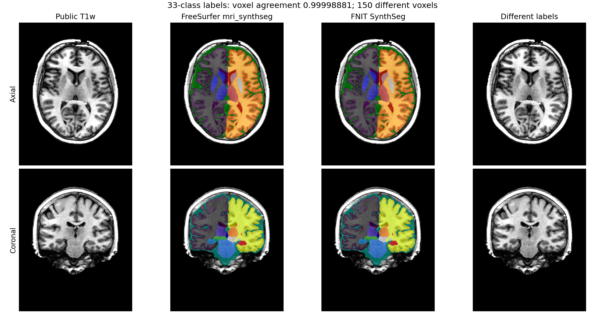

# README历史归档（2026-10-05）

本页保留文档整理前完整正文，原始正文SHA-256：`546732ac845cb04e13d2e2b924149864cf8c2f774dbe2d67f6b9d9182e529e54`。仅修正移位后的相对链接；最新用户手册见[功能README](../../docs/synthseg/README.md)。历史测量仍绑定原源码与输入，不改标当前main。

# 独立 33 类 SynthSeg

[返回首页](../../README.md) · [源码目录](../../src/fnit/synthseg_parc) · [权重](../../docs/WEIGHTS.md) · [2026-09-27 独立验证](report.public.json) · [2026-10-01 集成回归](../../docs/recon_all/SYNTHSEG_PRECISION.md)

`SynthSeg` 使用 FreeSurfer 8.2 的非 robust、非 parcellated SynthSeg 2.0 模型，从单幅 T1 生成 33 类结构标签和各结构软体积。它与 WMH-SynthSeg 是不同模型；本入口不输出 WMH 标签，也不生成皮层分区。推理使用 PyTorch，不需要安装 FreeSurfer、FSL 或 TensorFlow。

## 下载模型

在仓库根目录运行，或安装后用 `fnit-setup-weights` 代替 `python tools/setup_weights.py`。配置脚本下载固定的 `.h5` 和三个 `.npy` 文件，逐个核对大小与 SHA-256，然后记录权重目录。推理本身不联网。

```bash
python tools/setup_weights.py --model synthseg --dest /path/to/weights
```

这个组仅需四个文件，总计 53,087,016 字节，不需要下载 790 MB 的 WMH-SynthSeg 权重。已有模型时可用 `--verify-only` 检查。完整文件名、官方地址及哈希见[权重说明](../../docs/WEIGHTS.md)。

## Python API

```python
from fnit import SynthSeg

model = SynthSeg(
    weights=None,  # 权重：按 FNIT 配置顺序查找四个官方模型文件
    device="cuda:0",  # 设备：第一张可见 CUDA GPU
    threads=4,  # CPU 线程：用于预处理和后处理
    cudnn_tf32=True,  # 独立入口默认开启 GPU 卷积 TF32；recon-all 显式使用 False
)
result = model(
    image="sub-01_T1w.nii.gz",  # 输入：单幅 3D T1w
    keep_geometry=False,  # 输出网格：保留预处理后的 RAS、约 1 mm 网格
    color_lut=None,  # 色表：不附加外部 FreeSurfer LUT
)
result.segmentation.save(path="sub-01_synthseg.nii.gz")  # 输出路径：33 类硬分割图
result.write_volumes_csv(
    source="sub-01_T1w.nii.gz",  # CSV 标识：原始输入文件名
    path="sub-01_synthseg.vol.csv",  # 输出：软体积 CSV 路径
)
print(result.total_intracranial_mm3, result.volumes_mm3)
print(result.precision)  # 每次真实前向的 TF32、张量 dtype 与 autocast 设置
```

`SynthSeg(weights=None, device="cpu", threads=None, cudnn_tf32=True)` 在构造时加载一次模型；每次调用接收一幅图像。`weights` 可传包含四个文件的目录，或直接传 `synthseg_2.0.h5` 路径；三个 `.npy` 必须与这份 `.h5` 位于同一目录。省略 `weights` 时先查 `FNIT_WEIGHTS`、配置脚本记录的目录，再查默认缓存。输入是单幅 3D `.nii`、`.nii.gz`、`.mgz` T1 路径或 `nibabel.spatialimages.SpatialImage`。`threads=None` 保留调用方 PyTorch 线程数，负数使用 CPU 核数；非法设备、精度参数、缺失权重或推理失败时抛异常。

`result.segmentation` 是 `FNITNifti1Image`（`nibabel.Nifti1Image` 子类），默认位于 SynthSeg 预处理后的 RAS 方向、约 1 mm 网格。标签编号和存储类型均为 `int32`；NIfTI qform code 为 0，sform code 为 2。`model(image, keep_geometry=True)` 会将标签以最近邻法重采样到输入网格，并保持相同 dtype 与 form-code 契约。`color_lut="/path/to/FreeSurferColorLUT.txt"` 读取用户提供的 `编号 名称 R G B T` 文本色表，写入 NIfTI 的 FreeSurfer 颜色表扩展（代码 14），同时保留 `extra["color_lut"]`。编号、重复行或颜色范围不合法时抛出异常；默认不读取外部色表。

`result.volumes_mm3` 是 `{前景标签编号: 软体积}`，`result.total_intracranial_mm3` 是所有前景软体积之和，后验概率先恢复到输入方向，再按原版 NumPy float32 顺序求和并保留三位小数；`result.label_names` 对应 32 个前景结构名。CSV 列顺序、总量和近似并列标签规则与本仓库 GPU recon-all 的 `mri_synthseg` 入口相同。`result.near_tie_voxels` 记录近似并列规则相对于普通 `argmax` 更改的体素数。

## recon-all 集成发现的精度设置覆盖

原 `SynthSeg` 和 `SynthSegSegmenter` 构造时调用设备助手，会重新开启 cuDNN TF32，覆盖 pipeline 在模型构造前选择的 FP32 卷积策略。本轮修改这两个子函数：构造只选择设备，精度在模型构造后的实际前向作用域应用，正常和异常退出均恢复调用方 matmul/cuDNN 设置。独立接口默认 `cudnn_tf32=True`，保留 GPU 卷积 TF32；`False` 关闭该模型前向的 cuDNN TF32；`None` 沿用调用方 cuDNN 设置。CUDA matmul 在前向内仍开启 TF32。该参数是 Python API 选项，现有独立 CLI 继续使用默认 True。

`result.precision` 是字典，包含 `requested_cudnn_tf32`、`forwards` 列表、后验缓冲复用标记及集成 dtype。每个前向记录 original/flipped、device、matmul/cuDNN TF32、输入/模型/输出 dtype，以及 CPU/CUDA autocast 开关与目标 dtype。不主动开启 FP16/BF16，调用方已有 autocast 如实记录；不能仅凭 `cudnn_tf32=False` 宣称全部计算为 FP32。输入输出网格、标签、软体积定义及写出接口沿用上文。

内部 `SynthSegSegmenter(weights, labels, device="cpu", cudnn_tf32=True)` 读取固定 H5 与标签数组；`posterior(image=..., flip=True, smooth=True)` 接收预处理的三维强度张量，返回设备上的 `(33,D,H,W)` 后验概率。翻转集成复用内部缓冲并保留先相加、再乘 0.5 的顺序；首份后验在第二次 CUDA 前向期间仍暂存 CPU。`flip=True` 要求 `smooth=True`，否则抛 `ValueError`。这里没有独立原软件命令，是下节 `mri_synthseg` 的内部步骤。

本轮冻结 sub-01 的已验证 FP32 同输入回归中，缓冲复用前后保存的 MGZ 与 CSV 逐字节相同。缓存开启的 CLI/API 单阶段完整命令分别为 71.57/50.16 秒，父子合计显存采样峰值均为 18.14 GB；这些单次观测不构成稳定提速或整例缓存验收。修正 TF32→FP32 后与旧 TF32 结果有 148 个标签体素变化，不能把精度策略变化称为浮点尾差或随机性。完整输入、权重、源码、前向记录、计时边界及监测 SHA 见[当前子函数回归](../../docs/recon_all/SYNTHSEG_PRECISION.md)；三例独立默认 TF32 的旧报告仅属于下节日期和源码。本轮尚未重跑该三例独立入口，不将旧结果重标为当前版本。

## 原版命令与参数对应

本模块对应 FreeSurfer 8.2 `mri_synthseg` 的单幅、SynthSeg 2.0、非 robust、非
parcellated 路径。原版单例命令为：

```bash
mri_synthseg --i sub-01_T1w.nii.gz --o sub-01_synthseg.nii.gz \
  --vol sub-01_synthseg.vol.csv --threads 4
```

本包执行同一输入输出角色的命令为：

```bash
fnit synthseg --i sub-01_T1w.nii.gz --o sub-01_synthseg.nii.gz \
  --csv-vols sub-01_synthseg.vol.csv --device cuda:0 --threads 4
```

| 本包参数 | 原版参数 | 输入或输出 |
|---|---|---|
| `--i` | `--i` | 一幅 3D T1；本包接受 `.nii`、`.nii.gz` 或 `.mgz` 文件 |
| `--o` | `--o` | 33 类硬分割图；默认位于预处理后的 RAS、约 1 mm 网格 |
| `--csv-vols` | `--vol` | 前景结构软体积和 total intracranial volume，单位 mm³ |
| `--weights` | `--model` | 官方 `synthseg_2.0.h5`；本包还从同目录读取三份标签、名称和拓扑 `.npy` |
| `--device cpu` | `--cpu` | 强制 CPU；本包也可用 `--device cuda:N` 选择具体 GPU |
| `--threads` | `--threads` | PyTorch CPU 线程数；本包 CLI 默认 4，原版默认 1 |
| `--keep-geometry` | `--keepgeom` | 以最近邻法把硬标签重采样回输入网格 |
| `--color-lut` | `--addctab` / `--noaddctab` | 本包只在显式提供 FreeSurfer LUT 时附加色表；原版默认附加色表 |

原版的目录输入、robust、QC、posterior、CT、Photo-SynthSeg 和其他模型路径没有在此 33 类接口中实现。皮层分区请使用同一 CLI 的 `--parc` 或 [SynthSeg+ Python API](../../docs/synthseg_plus/README.md)。

## 命令行

```bash
fnit synthseg --i sub-01_T1w.nii.gz --o sub-01_synthseg.nii.gz \
  --csv-vols sub-01_synthseg.vol.csv --device cuda:0 --threads 4
```

可选参数为 `--weights /path/to/weights`、`--keep-geometry` 和 `--color-lut /path/to/FreeSurferColorLUT.txt`。命令行和 Python 每次均处理一幅图像。独立入口不依赖 recon-all 的原生运行包或个人 license。

## 与 FreeSurfer 8.2 的既有独立对照

### 2026-10-04 CPU 优化与回归

本次真实数据测试使用 CPU评测节点 的 8 个物理核、8 个计算线程；同组原版与 FNIT 使用相同亲和性，完整命令包含启动、权重读取、预处理、双向推理、后处理、CSV 和影像保存。逐标签 Dice、硬/软体积、几何和 GPU 回归见[本次验证记录](../smri_cpu_20261004/t2_seg/README.md)。早期共用 CPU 核组和随后独立 NUMA 核组保留各自身份，不合并计算速度比。

CPU 连通域改用 SciPy 的 6 邻接标记，保持原版的等大连通域顺序。普通入口既有的完整体积 oneDNN 保护作用域内，CPU U-Net 按深度切片计算，内部边界读取完整卷积邻域，仅在真实影像边缘补零；分块保留原非 oneDNN 后端并恢复调用者开关。输入/输出切片的目标大小为 256 MiB，这不是整例 RSS 上限。模型仍为 float32，训练、梯度计算及调用者已开启的 CPU autocast 沿用原卷积路径；CUDA 卷积与连通域仍使用既有实现。

本轮还修复预处理的浮点 endpoint 网格问题：3 幅原始 T1 的 CPU 网络输入 float32 数组 SHA 与官方相同。case01 旧代码少一层，使网络 padding 较小，旧较小输入的时间不能算等价加速。早期 oneDNN 分块在 case01 从约 154 秒降至 54–59 秒，但 case02 改变了两个原本与官方相同的标签体素，未通过严格门，不能作为默认无损优化。当前保留原 CPU 后端的分块在两例实际保存输出中与修正 baseline 硬标签逐值相同；CSV 最大差分别为 0.04/0.30 mm³，通过事先固定的 `rtol=1e-5, atol=0.01 mm³`。对官方两例仍各有一个标签体素差异，CSV 最大差为 0.28/0.80 mm³；不能称官方逐值一致。

原后端分块的 case01 两次完整 wall 为 133.71/171.51 秒，同输入 baseline 为 145.22/143.45 秒，官方为 127.19/56.34 秒，时间波动明显。确定的收益是该例 CPU RSS 从约 94 GB 降至约 15 GB；当前普通入口没有达到全面超越官方 CPU 的速度目标。详细逐区数值、当前第二例完整重复时间与未通过候选见[本次记录](../smri_cpu_20261004/t2_seg/README.md)。

修复的写出问题是：旧 `color_lut` 只存在于 Python `extra`，保存后丢失色表。新实现直接用 nibabel 写 NIfTI 扩展，生产推理不导入 Surfa。CPU 构造和推理保留调用方 CUDA TF32、cuDNN benchmark/deterministic 设置；这一合同包含异常路径测试。

同日另修复 `keep_geometry=True` 保存头信息：将 qform 标记为未启用时不再重新编码矩阵，避免斜位 T1 的 `pixdim` 被 affine 列范数覆盖。实际原始 T1 的 GPU 公共 CLI 输出 shape、affine、pixdim 与输入逐值相同，dtype 为 int32，qform/sform code 为 0/2；硬标签与原 GPU 输出恢复到同一原图网格后相同，CSV 数值相同。指定色表的该输出经原软件读写核对了全部 1811 个条目。独立原软件保存函数的同标签控制和实际 GPU 结果见[保存几何记录](../smri_cpu_20261004/t2_seg/keep_geometry.public.json)。

2026-09-27 在三幅仓库公开、去面容 T1w 上重跑当前源码和 FreeSurfer 8.2.0-1 `mri_synthseg --noaddctab`。候选推理没有调用 FreeSurfer。该次 33 类推理所用源码树 SHA-256 为 `39fa204aea7674ad7c6e09652d0f8750dd2872b1b78799812ab0d71b5b6c8972`。

本轮同时核对文件头：默认输出和 `keep_geometry=True` 均写 `int32`，qform code 为 0，sform code 为 2，与原版相同。一幅真实 T1w 的 `keep_geometry=True` 输出与输入 shape、affine 完全一致。 针对性测试为 `2 passed`；WMH-SynthSeg、SynthSR 和 TorchFAST 的最小跨模块回归为 `28 passed, 4 skipped`。

| 指标 | 三例结果 |
|---|---:|
| shape / 数值 affine / dtype / qform / sform | 3/3 一致 |
| 最低逐体素标签一致率 | 0.99998817 |
| 全部前景标签最低 Dice | 0.99902629 |
| CSV 最大绝对误差 | 104.06 mm³ |
| FNIT H100 完整命令 | 中位数 9.48 s [8.84–10.13] |

2026-09-27 的旧 CPU 路径单例为 55.57 s；与原版相比只有 1 个标签体素不同，CSV 最大差 0.24 mm³。原版三例 CPU 参考任务所在时段有重叠，中位数 304.23 s，因此不计算稳定加速倍数。GPU 单例 Torch 峰值 allocated 19,769 MiB、reserved 22,820 MiB。

2026-09-30 在 CPU评测节点 的 PyTorch 2.5.1 上，CPU oneDNN 路径处理真实 `sub-02` 时发生段错误。现版在 CPU 推理这一段关闭 MKLDNN，并在返回后恢复原设置；同输入的独立阶段和 recon-all 连续运行都通过 SynthSeg，后者耗时 368.14 秒，写出的软体积总量为 1,452,089.5 mm³。独立阶段观测进程 RSS 最大约 97.4 GiB。该设置不影响 CUDA 路径；旧 CPU 耗时不能代表现版。完整 recon-all CPU 运行已完成，输出完整性与网格检查通过，严格数值比较通过 2/138 项。[阶段记录](../recon_all/python_gpu_port/synthseg_cpu_backend_20260930.json)、[整例记录](../recon_all/python_gpu_port/current_full_runs_20260930.json)。

同一 CPU评测节点 上另行运行官方 FreeSurfer 8.2 `mri_synthseg --cpu --keepgeom --threads 4` 作参考；现版 FNIT 相比官方的 256³ 标签图有 33 个体素不同，32 个前景标签最低 Dice 为 0.999886，软体积 CSV 最大差 1.9 mm³。官方单次耗时 295.58 秒，FNIT 为 368.14 秒；共享节点单次计时只用于说明本次运行，不推断稳定速度比。官方输出仅在隔离的参考目录中用于比较，不作为 FNIT 输入。[逐项记录](../recon_all/python_gpu_port/synthseg_cpu_backend_20260930.json)。

完整逐例标签 Dice、CSV、shape/affine/dtype、输出哈希、实际命令和边界见[验证页](README.md)与[机器报告](report.public.json)。三例没有人工结构分割真值，这些数值只衡量对参考实现的复现程度。

下图使用本轮公开 `sub-02` 重跑。中间两列显示同网格标签，最后一列标出不同体素；该例逐体素一致率为 0.99998881。



## Reference

- 参考文献：Billot et al., *SynthSeg: Segmentation of brain MRI scans of any contrast and resolution without retraining*, Medical Image Analysis (2023), [doi:10.1016/j.media.2023.102789](https://doi.org/10.1016/j.media.2023.102789)。
- 原实现代码库：[FreeSurfer `mri_synthseg`](https://github.com/freesurfer/freesurfer/tree/dev/mri_synthseg)。
