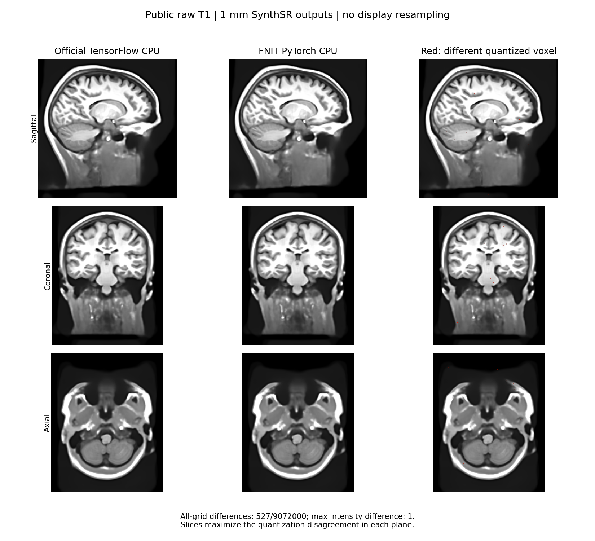
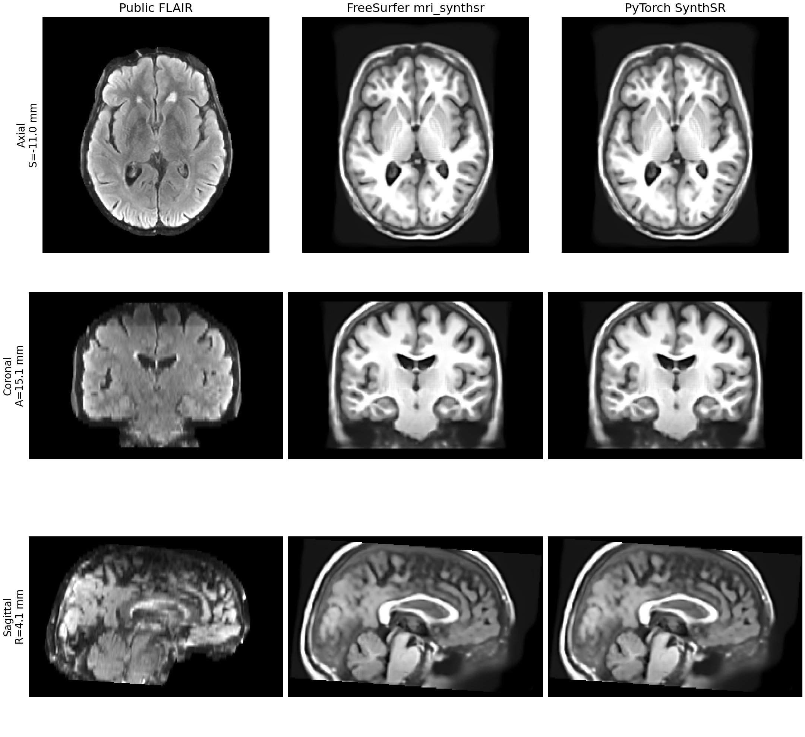

# README历史归档（2026-10-05）

本页保留文档整理前完整正文，原始正文SHA-256：`9f5414f12caeeb9d555cc2c4610febc5a7a947a8a6f355ab9e06272c6de60524`。仅修正移位后的相对链接；最新用户手册见[功能README](../../docs/synthsr/README.md)。历史测量仍绑定原源码与输入，不改标当前main。

# SynthSR：从单幅扫描合成 1 mm T1w

[返回首页](../../README.md) · [FreeSurfer 使用说明](https://surfer.nmr.mgh.harvard.edu/fswiki/SynthSR) · [原版源码](https://github.com/freesurfer/freesurfer/blob/dev/mri_synthsr/mri_synthsr) · [权重配置](../../docs/WEIGHTS.md)

SynthSR 接受一幅 3D MRI 或 CT，输出标准对比度的 1 mm 等方 MP-RAGE 图像。它结合超分辨率与图像合成，并在合成时填补白质病灶。输入可以是 T1w、T2w、FLAIR 等对比度；原版不要求事先去颅骨、校正偏场或归一化强度。本包将原版的 TensorFlow 网络和推理流程改写为 PyTorch，推理时不调用 FreeSurfer。

## 原版指令与模型

单幅 FLAIR 的原版调用如下。`--i` 读取扫描，`--o` 写合成 T1w，`--threads` 指定 CPU 线程数；安装了可用的 TensorFlow GPU 时，原版可自动使用 GPU，`--cpu` 则强制使用 CPU。

```bash
mri_synthsr --i case_FLAIR.nii.gz --o case_synthsr.nii.gz --threads 4
```

原版还接受 `--ct`（将以 Hounsfield 单位保存的 CT 截到 0–80）、`--lowfield`（低场单输入模型）、`--v1`（2021 年模型）、`--disable_flipping`（关闭翻转测试增强）、`--disable_sharpening`（关闭末端锐化）和 `--model /path/to/model.h5`（指定权重）。同时给出 `--v1` 和 `--lowfield` 时，原版先选择 `--v1`。独立的双输入 `mri_synthsr_hyperfine --t1 ... --t2 ...` 使用另一模型，不属于这里的单输入接口。

| 选择 | 官方权重 | 本包配置命令 |
|---|---|---|
| 默认，2023 年通用 v2 | `synthsr_v20_230130.h5` | `python tools/setup_weights.py --model synthsr` |
| 低场单输入 v2 | `synthsr_lowfield_v20_230130.h5` | `python tools/setup_weights.py --model synthsr-lowfield` |
| 通用 v1 | `synthsr_v10_210712.h5` | `python tools/setup_weights.py --model synthsr-v1` |

这些权重来自 [FreeSurfer 官方源码目录](https://github.com/freesurfer/freesurfer/tree/dev/mri_synthsr)及其 git-annex 存储。配置脚本下载后核对文件大小和 SHA-256，并记录权重目录；仓库和 wheel 不包含权重。推理只按显式路径、`FNIT_WEIGHTS`、配置目录和用户缓存查找，不会自动读取 `$FREESURFER_HOME/models/`，运行时也不会联网。下载链接、校验值和查找顺序见[权重说明](../../docs/WEIGHTS.md)。

## Python 输入与输出

```python
from fnit import SynthSR

super_resolution_model = SynthSR(
    weights=None,  # 权重：按 FNIT 配置顺序查找官方 HDF5
    device="cuda:0",  # 设备：第一张可见 CUDA GPU
    lowfield=False,  # 模型：不使用低场专用模型
    v1=False,  # 模型：使用默认 v2，而非 2021 年 v1
    threads=4,  # CPU 线程：用于预处理和后处理
)
super_resolution_result = super_resolution_model(
    image="case_FLAIR.nii.gz",  # 输入：单幅 3D MRI 或 CT
    ct=False,  # 输入类型：按 MRI 强度处理
    disable_flipping=False,  # 推理：保留左右翻转测试增强
    disable_sharpening=False,  # 后处理：保留末端锐化
)
super_resolution_result.image.save(path="case_synthsr.nii.gz")  # 输出路径：1 mm 合成 T1w
print(super_resolution_result.image.data.shape, super_resolution_result.image.affine)
```

构造 `SynthSR` 时加载一次权重；每次调用接收一幅影像。`device="cpu"` 是 Python 默认值；要用 GPU，显式指定 `"cuda:0"` 等设备。`weights` 可以是 `.h5` 文件或包含所选官方文件的目录；省略时按[权重配置](../../docs/WEIGHTS.md)自动查找。`threads` 控制 PyTorch CPU 线程，省略时保留当前设置。

| 本包接口 | 输入或返回值 | 原版对应 |
|---|---|---|
| `SynthSR(weights=None, device="cpu", lowfield=False, v1=False, threads=None)` | 选择设备、权重和单输入模型；`v1=True` 优先于 `lowfield=True` | `--model`、`--cpu`、`--lowfield`、`--v1`、`--threads` |
| `model(image, ct=False, disable_flipping=False, disable_sharpening=False)` | `image` 是单幅 `.nii`、`.nii.gz`、`.mgz`、`.npz` 路径或 `nibabel.spatialimages.SpatialImage` | `--i`、`--ct`、`--disable_flipping`、`--disable_sharpening` |
| `result.image.data` | 3D `numpy.ndarray`，`uint8`，是 NIfTI/MGZ 写盘前的量化数值 | `--o` 输出的体素数组 |
| `result.image.float_data` | 3D 浮点数组，锐化后、末端乘 2 前的原始输出强度；NPZ 写盘保存此字段 | 原版 NPZ 的 `vol_data` |
| `result.image.affine` | 4×4 RAS 仿射矩阵，描述 1 mm 输出网格 | `--o` 输出的几何信息 |
| `result.image.save(path)` | 写 `.nii`、`.nii.gz`、`.mgz` 或 `.npz` | `--o` 指定输出路径 |

原版先按输入 affine 重采样到 1 mm，再将体素轴对齐 RAS，居中补到 32 的倍数。网络是单通道、五层 3D U-Net。默认对左右翻转后的图像再推理一次并平均；预测截到 0–128，裁掉填充，再做锐化：原图加上原图与高斯模糊图之差，高斯标准差为 1.5 体素。最后转回输入的**轴方向**。因此输出与输入共享物理空间，但尺寸通常不同：它是 1 mm 网格，并未重采样回原始体素尺寸。写盘前乘以 2、截到 0–255、转换为 `uint8`。

`.npz` 是原版的特例：`save()` 将锐化后的浮点数组写在 `vol_data` 字段，**不执行 NIfTI/MGZ 的末端乘 2 和 `uint8` 转换**。因此 `result.image.data` 对应 NIfTI/MGZ 的量化数值；读 `.npz` 应使用 `numpy.load(path)["vol_data"]`，两者的数值尺度不同。原版及本包均通过 `nibabel.save(Nifti1Image(...))` 写 `.mgz`；用 nibabel 重新读入时，该格式报告的存储 dtype 为 `float32`，体素数值仍为量化后的 0–255。原版对常规输入使用单幅 3D 数据；当文件带多个通道时只取第一个通道。

`SpatialImage` 输入也支持自有、完全解码的 ndarray；仅 `nib.load()` 返回的对象仍可含 ArrayProxy。[默认完全物化 CPU API 验证](../smri_cpu/strip_sr_20261004/in_memory_20261004/README.md)按原解码值和 K-layout 覆盖了真实默认单例；参数、域和格式矩阵的既有 CLI 验收分别记录。

## 单例命令行

```bash
fnit synthsr --i case_FLAIR.nii.gz --o case_synthsr.nii.gz \
  --device cuda:0 --threads 4
```

这条命令读取 `case_FLAIR.nii.gz`，在 `cuda:0` 上用通用 v2 模型合成图像，并把 1 mm `uint8` T1w 写到 `case_synthsr.nii.gz`。本包的 `--device` 可选具体 GPU，原版没有对应的 GPU 编号参数；原版自动选择可用的 TensorFlow GPU。`--cpu` 可覆盖 `--device` 强制 CPU；`--weights` 或同义的 `--model` 指定本地权重。其余模型和处理开关与上表同名。单幅输入的 `--o` 也可指定目录，输出文件名自动加 `_synthsr`。

## 2026-10-04：相同 CPU 资源对照

CPU评测节点 对照统一使用 8 线程和 8 个物理核。默认两例公开原始 T1 按原版/FNIT/FNIT/原版运行；模型版本、翻转、锐化、真实 HU CT、64 mT 采集及输入/输出格式分别覆盖。完整命令时间和内部阶段时间分别记录，协议见[CPU 验证目录](../smri_cpu/strip_sr_20261004/README.md)。

运行源码保留 `1d31e7baa` 的 SynthSR 网络与流程；共享几何修复 `dc2fc052` 不改变这次 SR 网络。模型文件大小与 SHA-256 均同官方实际加载文件，原软件是 FreeSurfer 8.2.0-1、TensorFlow 2.13.1。本轮 **9 个模型/参数场景、7 个域/格式场景**均通过对应量化容差或 EPI NPZ 门槛。[模型与参数结果](../smri_cpu/strip_sr_20261004/reports/synthsr_cpu_functions.public.json)和[域/格式结果](../smri_cpu/strip_sr_20261004/reports/synthsr_cpu_domains.public.json)保留完整网格、dtype、affine、哈希、资源设置和重复。

| 真实输入与功能 | 官方 / FNIT 完整 CLI（s） | 量化差异体素 |
|---|---:|---:|
| 原始 T1 case01，默认 ABBA 中位数 | 62.810 / 42.800 | 527 / 9,072,000 |
| 原始 T1 case02，默认 ABBA 中位数 | 80.869 / 45.947 | 563 / 9,072,000 |
| 衍生 FLAIR | 123.898 / 21.037 | 399 |
| case01 v1 | 131.185 / 40.814 | 520 |
| case01 低场权重 | 39.053 / 40.559 | 628 |
| case01 同时 v1 + lowfield，v1 优先 | 87.622 / 39.558 | 520 |
| case01 关闭翻转 | 107.138 / 22.280 | 668 |
| case01 关闭锐化 | 78.604 / 36.804 | 397 |
| case01 同时关闭翻转和锐化 | 79.633 / 21.034 | 498 |
| 实际 HU CT，`ct=True` | 54.806 / 51.542 | 747 |
| 实际 64 mT T1，低场模型 | 33.803 / 40.311 | 610 |
| 真实 EPI 两帧，仅取第一通道 | 25.554 / 47.829 | 358 |
| 同一 EPI b0 的 MGZ 输入 | 108.650 / 42.062 | 373 |
| 同一 EPI b0 的 NPZ 输入/输出 | 8.265 / 8.765 | 浮点 allclose 通过；max 0.001572 |
| 同一 EPI b0，输出到目录 | 43.568 / 43.057 | 358 |
| 同一 EPI b0，输出未压缩 NIfTI | 65.841 / 49.817 | 358 |

量化结果的最差完全相同比例为实际 64 mT 的 **99.992227%**；所有 NIfTI 场景最大差为 1、完整网格 MAE≤`7.773e-5`。这通过预先固定的 exact≥99.99%、max≤1、MAE≤`1e-4` 量化容差，不是逐点相同。

**默认 case01 的浮点 NPZ 仍未通过。** 与官方 TensorFlow CPU 固定 `rtol=1e-5, atol=1e-3`，有 3,522 / 9,072,000 个体素超门槛，RMSE `9.821e-5`、最大差 `0.0191345`。[固定 gate](../smri_cpu/strip_sr_20261004/reports/synthsr_default_float_gate.public.json)与[尾部报告](../smri_cpu/strip_sr_20261004/reports/synthsr_float_tail.public.json)保留失败值；EPI NPZ 的通过不能代替默认 T1 的浮点验收。

实际两次 CNN 输入均逐元素等于官方 float32 输入，权重也一致。未乘 255 的原始网络预测 RMSE 为 `3.76e-7/4.01e-7`，最大差为 `6.00e-5/8.29e-5`。将同一官方 CNN 预测注入 FNIT 公开 API，预处理输入仍逐值同，最终 9,072,000 个浮点输出也全部逐值等于官方。将 FNIT 预测回放亦逐值恢复自身输出。因此差异已经定位到 **TensorFlow 与 PyTorch 网络的 FP32 计算**，不是读图、归一化、翻转平均、裁剪、Gaussian 锐化或方向恢复。[回放诊断](../smri_cpu/strip_sr_20261004/reports/synthsr_network_replay.public.json)不执行额外 CNN，不能用作耗时 benchmark。两种 BN 算式的 CPU 原型仍有 3,533/3,702 个超门槛点，未接入生产。

完整 CLI 的优势并非所有输入都有：实际低场、第一通道 EPI 和 NPZ 输入本轮慢于官方。官方 case01 两个默认完整进程为 94.821/30.798 s，GPFS 导入和缓存变化较大。另行观察实际两次网络，官方为 7.634+6.154 s、FNIT contiguous 为 13.827+14.092 s；预处理约 5.3/5.7 s。当前 CPU 网络还没有超过官方，完整进程速度不得写成稳定的网络加速。[阶段报告](../smri_cpu/strip_sr_20261004/reports/cpu_stage_profiles.public.json)与 CLI 时钟分开。

CPU channels-last 使观察进程由 47.805 降至 34.781 s，但相对当前 CPU 产生 465 个量化差异体素、NPZ 最大差 `0.0188980`，未通过量化逐值同及浮点 `rtol=1e-5, atol=1e-4` 的候选门槛。生产 SynthSR 保持原 CPU 布局，CUDA 路径也没有修改。

CPU SynthSR 构造保持调用方 CUDA 后端设置；本轮加入对应合同回归。GPU 构造沿用原有 TF32 默认。

下图为本轮 CC0 原始 T1 的两个 CPU 量化输出。显示只离散调整轴方向，不重采样；切片选择为差异最多的位置，红点表示强度相差 1 的体素。浮点 gate 仍以完整三维数值判断。



### 默认完全物化 SpatialImage API（v5 冻结）

2026-10-04 在 `task5_candidate_cpu_v5`（提交 `00fedf3544291b9c3e1db9b6c2d6fcef3917d958`）上，使用同源 case01 原始 T1 和 CPU评测节点 的相同 8 核/8 线程，执行 **一次默认 CPU API**，包含默认翻转的两次网络前向。输入完全解码为 float64/F-layout，自有 ndarray 保留 K-layout 和原几何；路径分支的 `get_fdata()` 默认 float64 与对象分支的 `asanyarray(dataobj)` 后统一 float64 分别记录。模型和真实网络张量仍为 CPU float32、contiguous。官方及旧 FNIT 默认结果均复用保存参考，没有重跑官方或其他模式。

同次结果保存为 uint8 NIfTI 与浮点 NPZ，二者都与旧 FNIT 默认保存结果逐值且文件 SHA 相同。对官方，uint8 图仍为 `527 / 9,072,000` 点差 1，99.9941909171% 逐值同，通过原量化门槛；浮点 max `0.019134521484375`、RMSE `9.82070268e-5`，仍未通过原 `rtol=1e-5, atol=1e-3`。与旧浮点数组逐值同，故既有 3,522 点超门槛的尾部结论仍适用。NIfTI 的完整 header、affine 和 sform 与两种保存参考逐值同；NPZ 不含 affine，几何由同次 NIfTI 核对。[匿名结果](../smri_cpu/strip_sr_20261004/in_memory_20261004/report.public.json)保留通过与失败。

| 本次单例范围 | 时间（s） |
|---|---:|
| metadata＋解码＋K-layout 复制＋对象构造 | 0.669 |
| 默认 API | 29.987 |
| 同次 NIfTI＋浮点 NPZ 保存 | 1.949 |
| 保存参考比较与几何核对 | 3.801 |
| 完整进程，含全部 provenance、哈希与比较 | 41.545 |

完整进程含 posthoc，本次只补测默认 CPU 对象入口，不能与原软件历史 CLI 时钟计算新加速比，也不能把上述 16 个 CLI 场景改记为对象模式全部通过。非重叠阶段、加载、GNU time、RSS 及 SHA 见[物化 API 报告](../smri_cpu/strip_sr_20261004/in_memory_20261004/README.md)。

## 2026-10-04：CPU网络首差定位

同一真实首层CNN输入和权重下，第一Conv+bias全264,241,152值相同；原Torch ELU有32,371,573点1 ULP差。按实际TensorFlow2.13.1随安装Eigen的packet `exp(x)-1`，逐步FP32且非融合乘加，验证原型可使整个首ELU逐值同。随后第二Conv输入和权重同时channels-last可逐值恢复官方，而首BN仍有max1.90735e-6差；首层匹配不足以验收完整网络。

完整ELU原型默认CPU API66.815 s，固定rtol1e-5/atol1e-3仍有1,935点失败、max0.0193863，量化457点差1；它仍未通过且更慢，故没有接入默认。成熟默认浮点3,522点失败和量化527点差1的结论保持，GPU网络保持原文件。实际模块/header SHA、完整中间张量统计、拒绝记录与复现见[首差定位报告](../smri_cpu/synth_fixes_20261004/README.md)。

## 2026-09-27：既有 GPU 与 CPU 对照

2026-09-27 用当时默认 TF32 和 Nibabel I/O 重跑 12 幅真实临床 T1w。候选推理没有调用 FreeSurfer；同一病例的 FreeSurfer 8.2.0-1 CPU/CUDA 输出作为固定参考。该历史版本 SynthSR 源码树 SHA-256 为 `7b5bc19e1afa806fe8698ea70b6358bacaab23b19877d20d21d2e7c5f3560543`。

12/12 例的 shape、`uint8` dtype 和数值 affine 均一致，affine 最大差为 0。该历史版本 GPU 对原版 CPU 的平均 MAE 为 0.02314 灰度级、平均 NRMSE 为 0.001580，最低完全相同体素比例为 96.3994%，最大差为 9。该历史版本 CPU 单例对原版 CPU 的完全相同体素比例为 99.99497%，最大差为 1。默认 TF32 会改变更多靠近量化边界的体素，因此该历史版本 GPU 结果不能写成逐体素等价。

| 运行 | 完整单例命令时间 |
|---|---:|
| FreeSurfer 原版 CPU，固定同批 12 例参考 | 中位数 103.60 s |
| FreeSurfer 原版 CUDA，固定同批 12 例参考 | 中位数 53.27 s |
| FNIT 该历史源码 H100 GPU，12 例重跑 | 中位数 14.45 s [13.05–16.88] |
| FNIT 该历史源码 CPU，1 例 | 31.36 s |

原版和该次候选来自不同运行时段，表中不计算稳定加速倍数。独占 GPU 单例的 Torch 峰值 allocated 13,780 MiB、reserved 19,074 MiB。逐例数值、命令、输出契约与源码哈希见[验证页](README.md)和[机器报告](report.public.json)。

### 该次公开 FLAIR 示意图

下图使用仓库公开 `sub-04` FLAIR，并用当时默认 TF32 重新生成 FNIT 一列。临床 12 例统计与这幅公开示意图不是同一数据集。公开图两幅输出的 shape、`uint8` 和 affine 一致，完全相同体素比例为 97.8558%，MAE 为 0.02145 灰度级，最大差为 2。



## 最近版本更新与 benchmark

| 版本 | 修改与验收 | 当前结果 |
|---|---|---|
| 2026-10-04，`task5_candidate_cpu_v5` 默认完全物化 API | 同源 case01 原解码值/K-layout 自有 ndarray；默认 API 一次、两次网络前向；复用官方和 FNIT 保存参考。[报告](../smri_cpu/strip_sr_20261004/in_memory_20261004/README.md) | NIfTI/NPZ 与保存 FNIT 逐值且文件 SHA 同；官方量化通过、浮点原门仍失败。API 29.987 s、两份保存 1.949 s；含 posthoc 完整进程 41.545 s，不计算新加速比。 |
| 2026-10-04，SynthSR 模块仍为 `1d31e7baa` | 16 个真实参数/域/格式场景；CPU CUDA策略合同；同网络输入与输出回放诊断 | 量化容差通过；默认 T1 浮点门槛未通过，误差定位网络 FP32 计算。CPU layout/BN 原型不接入，GPU 生产路径不变。 |
| 2026-09-27，源码树 `7b5bc19e…` | 12 例临床 T1 的既有 TF32 GPU 对照，独立 CPU 单例 | 历史 GPU 平均 MAE 0.02314；完整命令中位数 14.45 s。时间来自不同运行时段，不作为本轮 CPU 提速。 |

## Reference

- 参考文献：Iglesias et al., *SynthSR: A public AI tool to turn heterogeneous clinical brain scans into high-resolution T1-weighted images for 3D morphometry*, Science Advances (2023), [doi:10.1126/sciadv.add3607](https://doi.org/10.1126/sciadv.add3607)。
- 原实现代码库：[FreeSurfer `mri_synthsr`](https://github.com/freesurfer/freesurfer/tree/dev/mri_synthsr)。
