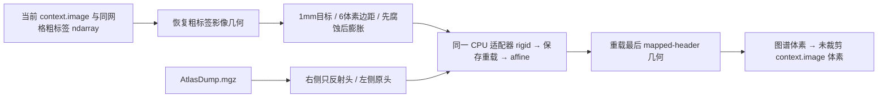

# GEMS 的 CPU 初始对齐实验桥

## 1. 功能简介

本目录提供海马/杏仁核的**初始对齐**入口。显式选择 `cpu-robust-experiment` 后，调用已验证的目标准备、右侧图谱头反射及可复用 CPU rigid→affine 实验适配器，最后重载第二阶段 mapmovhdr 的 MGH 头，并转换到当前 GEMS 处理网格。它返回图谱体素到 `context.image` 体素的 4×4 Double 矩阵，供后续 `atlas.transformed(matrix, transform_reference=True)` 使用。

当前版本已在一个公开 T1 右侧海马/杏仁核准备输入上完成初始对齐验收：原20项配准门通过，准备体素和头信息一致，最终空间点及源定义网格映射差为0。它位于 checkout 的 `validation`，不属于已安装 wheel 的生产 API。`GEMSRecipe.run`、`fnit segment-4-subregions` 和 GPU 计算继续使用当前 softDice 路径。源码没有调用原软件，没有新增依赖。



## 2. Python 调用、输入输出和参数

需要 FNIT 完整 checkout，以及主页 Conda 环境中的 PyTorch、NumPy、Numba、nibabel 和 SciPy。推荐先 editable 安装该 checkout。模型推断不是本步骤的一部分；粗标签必须已经提供。图谱目录由现有外置图谱设置准备，不在此步骤下载。

```python
from pathlib import Path
import sys

repository_root = Path("/absolute/path/FNIT")  # 完整源码仓库，含 src 与 validation
sys.path.insert(0, str(repository_root))
sys.path.insert(0, str(repository_root / "src"))
from fnit.gems.context import SubregionContext
from fnit.gems.recipes.hippo_amygdala import HippoAmygdalaRecipe
from validation.robust_register.full_cpu_arithmetic_20261007.cpu_experiment_adapter import load_cpu_candidate
from validation.torchgems.cpu_initial_alignment_20261007.alignment_experiment import initialize_recipe_alignment

processing_image_path = "/absolute/path/norm.mgz"  # 当前处理网格的3D强度影像
coarse_label_path = "/absolute/path/aseg.mgz"       # 同形状、同几何的整型粗标签
atlas_directory = "/absolute/path/atlases/hippo-amygdala-right"  # 含 AtlasDump.mgz
context = SubregionContext.prepare(
    processing_image_path, need_coarse=True, need_parc=False,
    coarse_segmentation=coarse_label_path, device="cpu",  # 已提供标签，不推断 SynthSeg
)
recipe = HippoAmygdalaRecipe("right", atlas_directory)  # 右侧选择53/54；左侧为17/18
with load_cpu_candidate(repository_root) as cpu_candidate:  # 加载一次，可顺序复用给多个输入
    initial_alignment = initialize_recipe_alignment(
        recipe, context, method="cpu-robust-experiment", device="cpu",
        cpu_candidate=cpu_candidate,
        output_directory="/absolute/path/new_initial_alignment",  # 必须尚不存在
        coarse_reference=coarse_label_path,  # 核验原标签值和 Double 几何并保留原头
        registration_parameters=None,       # 使用下表已测 rigid/affine 参数
    )
atlas_to_context_voxel = initial_alignment.atlas_to_context_voxel  # float64，4×4
alignment_report = initial_alignment.report  # 准备、参数、坐标定义和阶段时间
# 本示例到初始对齐结束，没有运行 mesh / intensity / postprocess。
```

### 输入与坐标定义

| 输入 | 格式与含义 |
| --- | --- |
| `recipe` | 当前 `HippoAmygdalaRecipe`，左右侧名称、标签ID和目录均沿用现有 GEMS recipe |
| `context` | `SubregionContext`；`image` 为当前3D处理影像，`coarse_segmentation` 为同网格 `int32` ndarray；真实 SubregionContext.prepare 已规范到该类型 |
| `context.image` | MGH/MGZ 或 NIfTI；定义矩阵的最终体素坐标。自动预处理后它可能与原始 `native_image` 不同 |
| `coarse_reference` | 可选标签影像或路径；提供时须与 context 标签值、形状和源定义 Double affine **完全相同**。不使用近似几何来替换 |
| `AtlasDump.mgz` | 原模板体素，不读取细分结果或官方配准矩阵作为计算输入；右侧只改变 scanner RAS 头信息，体素顺序不动 |
| `output_directory` | 新目录，保存自产目标、图谱头、两阶段配准及CLI报告；不覆盖已有结果 |

标签 ndarray 本身不带空间头。未提供 `coarse_reference` 时，MGH 使用成熟 `_geometry` / `_mgh_image` 恢复头信息；NIfTI复制当前影像头并设整型数据。恢复后再次检查 Double affine。提供原标签影像是本次真实验收的优先路径，避免把不同处理网格当作同一输入。

最终转换为 `inverse(context_voxel_to_RAS) @ reloaded_final_atlas_voxel_to_RAS`。官方 SAMSEG 在第二次 `--mapmovhdr` 后重新读 MGH，再使用其 `vox2world`；直接采用 `combined_RAS @ original_atlas_geometry` 会遗漏最后 MGH Float32 头信息的保存量化边界。组合 RAS 仍保留在 pair 结果中作配准报告。这里的 Double 小矩阵使用 NumPy `inv` / `matmul`，对应安装版 Surfa 的几何算法；不套用 robust-register 内部 Eigen 保序算术。Surfa 不作为运行依赖。**目标 mask 裁剪 affine 和 `context.native_image` 均不用于最终输出坐标。** 后续 GEMS 的工作网格/HR ROI 裁剪仍由现有 recipe 完成。

### 函数参数

| 参数 | 默认值 | 含义 |
| --- | --- | --- |
| `method` | `"soft-dice"` | 直接委托现有 `estimate_mask_affine`；实验 CPU 路径必须显式指定 `"cpu-robust-experiment"` |
| `device` | `"cpu"` | softDice透传原设备；CPU 实验只接受 CPU，不静默切换 GPU |
| `cpu_candidate` | `None` | CPU 路径须传入仍打开的适配器；同实例复用 JIT 缓存，用 `with` / `close()` 释放 |
| `output_directory` | `None` | CPU 路径必填新目录；softDice不写该目录 |
| `coarse_reference` | `None` | 原同网格粗标签影像；否则从 ndarray 和 context.image 构造标签头 |
| `registration_parameters` | `None` | 可覆盖下表参数；禁止 `mode`，固定先 rigid 再 affine。覆盖参数不继承原案例验收结论 |

| 配准参数 | 默认值 | 含义 |
| --- | --- | --- |
| `device` | `cpu` | CPU接口；不能改为CUDA |
| `saturation` | `50.0` | Tukey 鲁棒截止参数，与固定官方命令 `--sat 50` 对应 |
| `iterations_per_level` | `5` | 每层最大外循环 |
| `stop_distance` | `0.01` | 变换停止距离 |
| `initialize_translation` | `True` | 质心平移初始化 |
| `pyramid_min_size` | `16` | 最小金字塔尺寸 |
| `pyramid_max_size` | `-1` | 原默认上界行为 |
| `highres_iterations` | `-1` | 原默认高分辨率轮数行为 |
| `spatial_chunk_size` | `131072` | 图像采样分块大小 |
| `memory_budget_gb` | `20.0` | 项目声明的内存/显存预算参数 |
| `tf32` | `True` | 透传原参数；本 CPU 算术不使用 TF32，不修改全局精度标志 |

目标准备固定为 `target_voxel_mm=1.0`、`bbox_margin_voxels=6`、`smoothing="backward"`，即先腐蚀后膨胀；需要的标签由 recipe 选择。本阶段不支持其它核团的 CPU robust 选择器。

### 返回值和文件结构

`InitialAlignmentResult` 包含：

- `atlas_to_context_voxel`：4×4 `float64` 矩阵，原 `AtlasDump` 体素索引到未裁剪 `context.image` 体素坐标。
- `report`：方法、侧别、目标准备、坐标框架、参数和阶段墙钟。CPU 路径的 `alignment_dice=None`，不把 robust error 冒称 softDice。
- `registration_result`：CPU适配器原 pair dict，包含 `rigid`、`affine`、`combined_RAS_matrix`、`header_image` 和 `seconds`；softDice为 `None`。

CPU输出目录：

```text
new_initial_alignment/
  atlas.source.mgz               # 自产右侧反射头或左侧原头
  target.mask.mgz                # 自产0/255掩膜
  registration/
    rigid.lta
    rigid.header.mgz
    affine.lta
    affine.header.mgz
  alignment.report.json          # CLI保存；Python返回report，由调用者决定保存
```

上述四份配准文件路径由指定目录确定；原 pair dict 不另提供 output_files，也不自动保存两份 stage report JSON。Python函数保存图像/配准输出，CLI额外保存安全JSON。无静默错误修补：输入空间不一致、目录已存在、关闭后的实例、原候选秩亏等错误直接抛出；候选 helper 的 unsupported `None` 仍走原表达式，秩亏 `ValueError` 保留。

## 3. 命令行调用

```bash
python validation/torchgems/cpu_initial_alignment_20261007/run_initial_alignment.py \
  --repository-root /absolute/path/FNIT \
  --image /absolute/path/norm.mgz \
  --coarse-segmentation /absolute/path/aseg.mgz \
  --atlas-directory /absolute/path/atlases/hippo-amygdala-right \
  --side right --device cpu --threads 8 \
  --output-directory /absolute/path/new_initial_alignment
```

`--image` 是当前处理影像，不自动 conformation；`--coarse-segmentation` 是同网格整型标签；`--atlas-directory` 含模板；`--side` 选择左右；`--output-directory` 必須不存在；`--repository-root` 指完整 checkout。`--threads` 可选，仅 CLI 显式设置 Torch intra-op，Python函数不修改调用方线程/TF32标志。`--device` 只允许 `cpu`，在科学导入前由 parser 拒绝 CUDA。当前 CLI 仅验证了 help/parser 入口，尚未单独读取真实影像执行；本节命令不构成 CLI 端到端 benchmark。

## 4. 原软件调用

原步骤位于 FreeSurfer SAMSEG 的 `MeshModel.align_atlas_to_seg`，没有独立“GEMS初始对齐”命令。海马/杏仁核右侧先反射 AtlasDump 头，再准备0/255目标，随后原内部执行：

```bash
mri_robust_register --mov flippedAtlasDump.mgz --dst targetMask.mgz \
  --lta rigid.lta --mapmovhdr rigid.header.mgz --sat 50 -verbose 0
mri_robust_register --mov rigid.header.mgz --dst targetMask.mgz \
  --lta affine.lta --mapmovhdr affine.header.mgz --affine --sat 50 -verbose 0
```

原先两个命令分别得到源→目标的增量 scanner RAS 变换，第二次输入是第一步保存重载的头。随后原 `crop_image_by_atlas` 用处理影像的 `world2vox` 乘重新读取的最终图谱 `vox2world`，再扣除后续crop下界。此桥只返回扣crop前的处理网格矩阵。FNIT实验运行不执行这些命令；本次验收读取既有官方冻结结果作评分，未重跑这些原命令。

## 5. 精度、耗时和可视化

本次使用一个公开 T1 的右侧海马/杏仁核真实准备输入。新桥自产目标、反射图谱头和一次 rigid→affine；原官方结果只进入后续评分。精度结论来自服务器原比较记录的安全标量汇总，本地没有转移或重构影像、矩阵、网格数组、原 maps 或日志正文。

| 验收边界 | 本次结果 | 参照及阈值 |
| --- | --- | --- |
| 准备目标与反射图谱 | 两幅影像分别对官方/FNIT既有参考：0不同体素，shape、dtype和各13 MGH字段exact | 官方冻结准备结果；不修改输入或mask |
| rigid / affine | 原20/20；两阶段133点位移、共享采样相对L2、非零支持差全0；26个mapped-MGH字段exact | 原20门阈值保留；共享FNIT sampler，非官方独立重采样器 |
| LTA数字 | rigid最大差4.97×10⁻¹⁴；affine3.997×10⁻¹⁵ | 文本存储的微小尾差；组合变换和最终MGH空间一致 |
| 最终frame | 重载final-MGH再转未裁剪context；自身公式和官方保存头参照的matrix最大差均0 | 自洽公式≤1e−10；跨版本matrix误差只报告，不新增注册门 |
| 133空间点 | scanner RAS RMS/max均0 mm | 原RMS≤0.001、max≤0.01 mm |
| 真实atlas mesh | 20,100个Double参考点、122,333个四面体；原文本点ID唯一、row/corner顺序一致；物理RMS/max均0 mm | 物理max≤0.001 mm；同固定context/官方保存头按源公式构建参照 |

网格参照是**源定义参照**，不是官方 `KvlMeshCollection.read/transform` 自产初始网格轨迹；当前没有由此推断最终核团 Dice/体积或完整 GEMS 一致。左右两侧与不同处理网格仍应分别验证。

### 分步骤时间

同一8核分配和线程环境预算；官方实际有效并发未观测。本次没有新运行官方CLI，也不据此声称等价全GEMS加速。

| 本次步骤 | 秒 | 时钟范围 |
| --- | ---: | --- |
| given-label context.prepare | 0.333 | 读取处理影像与已给粗标签；模型调用0 |
| 一次CPU适配器factory | 0.029 | 独立于bridge API |
| 目标准备、右侧反射和保存 | 0.739 | bridge内部，包含两幅准备影像写出 |
| 一次rigid→保存/重载→affine API | 2.159 | 冷JIT包含在调用内；没有每轮身份检查开销 |
| 最终MGH重载与frame conversion | 0.008 | NumPy Double小矩阵 |
| bridge API合计 | 2.906 | 上述准备+pair+frame；不含context/factory/外部检查 |
| 保存输出的原20评分 | 0.199 | 后续恢复组，未重跑context/pair/JIT |
| atlas读取、第二文本布局核对和映射 | 3.111 | 后续恢复组；不是单一mesh乘法kernel时间 |
| 恢复组entry | 13.151 | 含两个运行库身份检查点和评分/mesh/metadata |

两个恢复运行库身份检查点分别约3.644和3.587秒，包含 maps、文件SHA与记录；不是纯SHA或API算术时间。既有同输入[CPU适配器benchmark](../../robust_register/full_cpu_arithmetic_20261007/README.md)另给冷pair2.147、热pair0.790、官方2CLI合计1.031秒，时钟范围不同；此处只作组件历史，不与新桥总时长相除。

### 失败与恢复边界

第一次组的context/prep/pair已成功耐久，配准后运行库门检测到37个未预封存的现有 H5py/HDF5 依赖而停止，原组控制结果为false并保留FAIL。通过仅元数据的Conda成员/实际文件身份核对后，将原196集合与37新增身份封为233；原集合和失败收据不改。

随后一次恢复**只读取原保存的6个图像/变换文件、Double矩阵及报告**，运行原20评分和mesh映射；context/prep/pair/registration/JIT/native/GPU新调用全0。数值先耐久保存，再核185个实际运行库为233封印的精确literal子集，最终控制通过。评分实例保持live到相对导入结束，再关闭，线程/精度策略不变；全部进程与共同CPU资源、索引均已关闭。该恢复不算第二次配准尝试。

### 可视化与未验范围

本次自产准备结果与既有[CC0目标准备三视图](../../robust_register/target_preparation_20261006/preparation_targets.png)为0体素/几何差，因此保留该图作准备组件的可视化，并明确它来自此前准备报告，未冒称新完整GEMS脑图。


尚未测试：完整mesh优化、强度拟合、后处理核团Dice/体积、官方C++自然初始mesh、左侧、新处理网格/HR crop、无原标签影像的ndarray头恢复路径及GPU。CPU桥为显式checkout实验入口；wheel/生产API迁移另列验收，不默认启用。

## 6. 更新与 benchmark 记录

- 2026-10-07真实初始对齐：一次context/prep/pair输出耐久；运行库资格后门首FAIL保留；仅保存结果评分/mesh恢复最终通过原20和所有新frame/mesh门，没有第二次配准。
- 2026-10-07源提案v3：核对公共SAMSEG core.py与固定安装源完全相同后，明确最终矩阵取保存后重载的mapped-header几何；安装版Surfa几何方法与公共源AST相同，最终转换采用其NumPy Double定义，保留未执行v1遗漏该存储边界的提案。新增显式CPU selector与独立CLI，默认softDice的参数和函数调用保持；不改 `GEMSRecipe.run`。读取固定INDEX定位原准备数据/官方冻结参考，新增代码仅AST/parser级检查。
- 本桥复用[目标准备](../../robust_register/target_preparation_20261006/README.md)和[可复用CPU适配器](../../robust_register/full_cpu_arithmetic_20261007/README.md)，不复制原SDK程序。以调用方持有的同一实例运行，避免每次函数调用创建新的JIT命名空间。
- 后续打包路径：将已验CPU四算术helper和原实验注册模块纳入 `src/fnit/robust_register` 独立命名CPU profile；保持CPU选择显式、GPU/default原函数独立。当前版本仍依赖checkout validation，不能声称Conda/wheel生产安装完成。独立稳定src CPU profile正在准备打包/API验收；本目录结论不提前覆盖安装版生产API或默认GEMS。

## 7. 原实现、许可和参考文献

- [FreeSurfer固定源提交d932c45](https://github.com/freesurfer/freesurfer/tree/d932c45b7941662ea380a05efef580568b98d41a)的 mri_robust_register；[SAMSEG原代码库](https://github.com/freesurfer/samseg)的 subregions/core.py、hippocampus.py；参考安装版8.2。原源身份在私密计划冻结，不复制发布SDK源码。
- [FNIT目标准备说明](../../../docs/robust_register/PREPARATION.md)和[当前亚区分割说明](../../../docs/subregions/README.md)；本目录没有改写其当前默认方法。
- Reuter M, Rosas HD, Fischl B. Highly accurate inverse consistent registration: a robust approach. NeuroImage (2010), [doi:10.1016/j.neuroimage.2010.07.020](https://doi.org/10.1016/j.neuroimage.2010.07.020)。
- Iglesias JE et al. A computational atlas of the hippocampal formation using ex vivo, ultra-high resolution MRI. NeuroImage (2015), [doi:10.1016/j.neuroimage.2015.04.042](https://doi.org/10.1016/j.neuroimage.2015.04.042)。
- Saygin ZM et al. High-resolution magnetic resonance imaging reveals nuclei of the human amygdala. NeuroImage (2017), [doi:10.1016/j.neuroimage.2017.04.046](https://doi.org/10.1016/j.neuroimage.2017.04.046)。
- 模板获取/使用许可沿FNIT现有外置资源设置；本桥不再分发模板或影像。[FreeSurfer许可](../../../licenses/FreeSurfer.txt)、[Surfa几何改编的MIT归属](../../../licenses/surfa-MIT.txt)保留；运行不导入Surfa。
